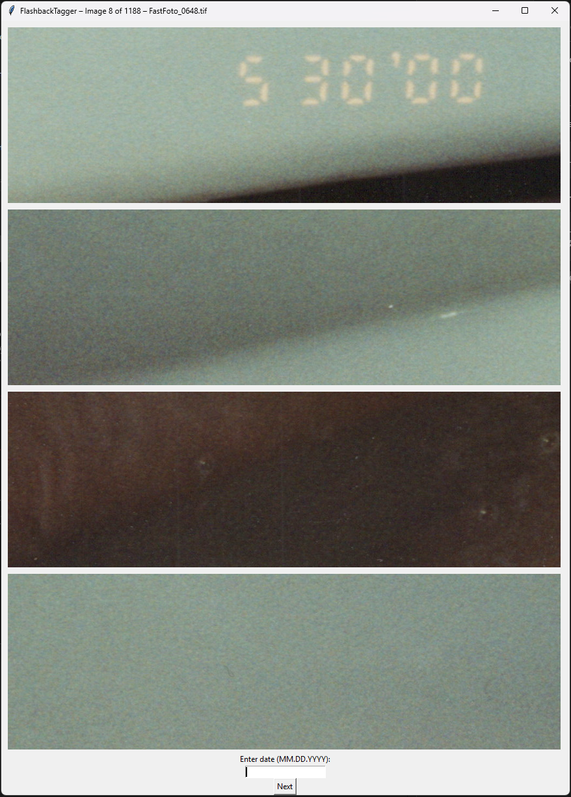

# FlashBackTagger
Aids in tagging scanned in photographs with capture dates

# Usage
  If you are working with .TIF files, install EXIFTOOL first.

    choco install exiftool
  
  Then install packages and run.

    pip install -r .\requirements.txt
    python ./flashbacktagger.py

  Optionally provide `--exclude` to exclude filenames containing the string provided.

The script will take a crop from all four corners of each picture. Once the date is entered and `Next` is clicked (or enter key is pressed), the date will be saved to the image.

Clicking `Shift + Enter` will go back to the previous image.